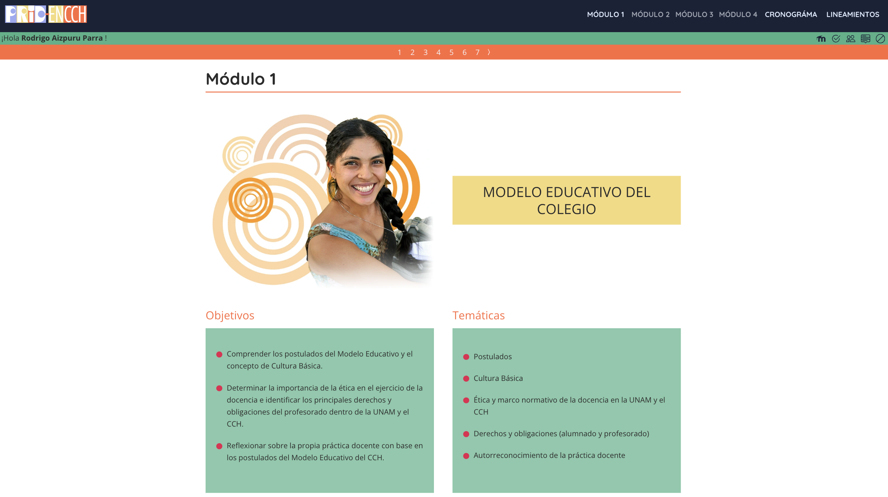

# Programa de Regularización e Iniciación a la Docencia (PRID-25)

Este repositorio contiene el código fuente del Programa de Regularización e Iniciación a la Docencia (PRID-25). El objetivo del programa es proporcionar una formación integral a los docentes de reciente ingreso, comprendiendo el Modelo Educativo del Colegio de Ciencias y Humanidades (CCH) y fortaleciendo la reflexión sobre el quehacer docente.

## Estructura del Proyecto

El proyecto está estructurado de la siguiente manera:

## Instalación

Sigue estos pasos para instalar y ejecutar el proyecto en tu entorno local:

1. **Clona el repositorio:**

    ```sh
    git clone https://github.com/tu-usuario/prid-25.git
    cd prid-25
    ```

2. **Instala las dependencias:**

    Asegúrate de tener [Node.js](https://nodejs.org/) instalado. Luego, ejecuta:

    ```sh
    npm install
    ```

3. **Compila los archivos:**

    Ejecuta el siguiente comando para compilar los archivos CSS y JavaScript:

    ```sh
    npm run build
    ```

## Uso

El proyecto incluye varias funcionalidades, como la navegación entre módulos, la visualización de actividades y la integración con Moodle para la gestión de calificaciones y foros. Puedes acceder a las diferentes secciones a través de la barra de navegación en la interfaz principal.

## Licencia

Este proyecto está licenciado bajo la Licencia MIT. Consulta el archivo LICENSE para más detalles.

## Contacto

Si tienes alguna pregunta o sugerencia, no dudes en abrir un issue o contactar al manager del proyecto.

---


